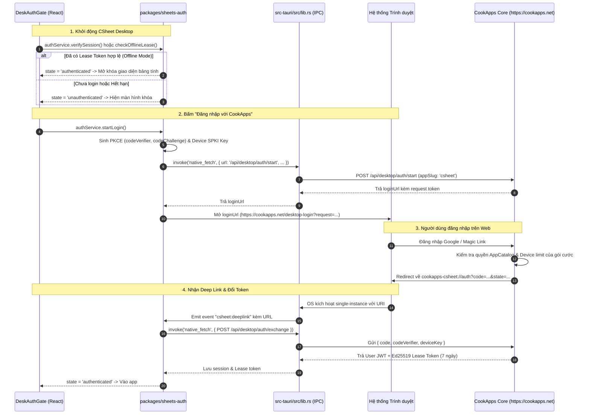

# CookApps Desktop Auth - CSheet Integration Runbook

Tài liệu hướng dẫn chi tiết luồng xác thực đăng nhập và kiểm tra bản quyền cho ứng dụng **CSheet** (`csheet`) kết nối với nền tảng máy chủ **CookApps Core** (`f:\Projects\CookApps`).

---

## 1. Thông số Cố định của CSheet (Fixed Identifiers)

Khi làm việc trong repo này, Agent PHẢI tuân thủ chính xác các định danh sau:
- **Core Platform URL**: `https://cookapps.net` (Prod) hoặc `http://localhost:3000` (Dev).
- **Core Repository**: `f:\Projects\CookApps`
- **App Slug (`appSlug`)**: `csheet`
- **App Name**: `CSheet` / `CookApps Sheet`
- **Tauri Identifier**: `net.cookapps.csheet` (trong `src-tauri/tauri.conf.json`)
- **OS Protocol Scheme**: `cookapps-csheet`
- **Callback URL**: `cookapps-csheet://auth?code=...&state=...`
- **Tauri Deep Link Event**: `csheet:deeplink`
- **File Open Event**: `csheet:open_file`
- **Lease Public Key (Base64 SPKI)**:
  `MCowBQYDK2VwAyEAvSTxJ6EC0pASM2tyZYWRB7MZ7KTw/g3g03FwGPIh+EM=`

---

## 2. Bản đồ Mã nguồn Xác thực trong CSheet (Codebase Map)

| Module / File | Vai trò kỹ thuật |
| :--- | :--- |
| `packages/sheets-auth/src/service.ts` | `AuthService`: điều phối `startLogin`, `handleCallbackUrl`, `exchangeCode`, `verifySession`, `checkOfflineLease`. |
| `packages/sheets-auth/src/crypto.ts` | Sinh Ed25519 device keypair, tạo chữ ký device proof, sinh PKCE challenge/verifier, kiểm tra chữ ký lease token. |
| `packages/sheets-auth/src/store.ts` | `SecureAuthStore`: lưu accessToken, deviceKey, pending PKCE, lease tokens vào storage. |
| `apps/web/src/desk-auth/DeskAuthGate.tsx` | Rào chắn bản quyền full-screen chặn giao diện spreadsheet nếu chưa đăng nhập hoặc hết hạn lease. |
| `apps/web/src/desk-auth/desk-auth-context.tsx` | React Context quản lý trạng thái auth (`checking`, `unauthenticated`, `authenticated`, `upgrade_required`, `device_limit`). |
| `src-tauri/src/lib.rs` | Rust backend: chứa lệnh `native_fetch` (dùng `reqwest` bypass CORS WebView2), plugin `single-instance`, và plugin `deep-link`. |
| `src-tauri/tauri.conf.json` | Đăng ký scheme `cookapps-csheet` và bundle options. |
| `scripts/register_scheme.ps1` | Script Windows ghi Registry cho môi trường development / debug build. |

---

## 3. Luồng hoạt động chi tiết (Flow Sequence)



---

## 4. Các Quy tắc Bắt buộc Agent phải Tuân theo

### 1. Luôn dùng `native_fetch` cho Mọi Request lên Server
WebView2 chạy tại `http://tauri.localhost`. Nếu dùng trình duyệt `fetch()` gọi `https://cookapps.net`, WebView2 sẽ chặn CORS.
- Mã Rust trong [lib.rs](file:///F:/Projects/OFFICE/sheets/src-tauri/src/lib.rs) đã lọc bỏ header `cookie` nhạy cảm và dùng `reqwest` gửi request native độc lập.

### 2. Không sửa đổi `APP_SLUG`
- `APP_SLUG` trong repo này BẮT BUỘC là `'csheet'`. Không sửa thành `casual-sheets`, `sheet`, hay bất kỳ tên nào khác.
- Server CookApps chỉ cấp phép cho bản ghi đã đăng ký trong bảng `AppCatalog` với slug `csheet`.

### 3. Đăng ký Scheme Windows khi Debug / Dev
Khi chạy `pnpm tauri dev`, Windows chưa ghi nhận scheme `cookapps-csheet://`.
Chạy PowerShell script trước khi test login:
```powershell
powershell -ExecutionPolicy Bypass -File scripts/register_scheme.ps1
```

### 4. Đảm bảo Kênh Fallback Nhập mã Thủ công
Nếu trình duyệt hoặc phần mềm diệt virus chặn Deep Link:
- Trên Web: trang `/desktop-login` cung cấp 1-time exchange code.
- Trên CSheet: `DeskAuthGate` cho phép user dán code trực tiếp để gọi `exchangeCode()` mà không phụ thuộc vào OS URI handler.
